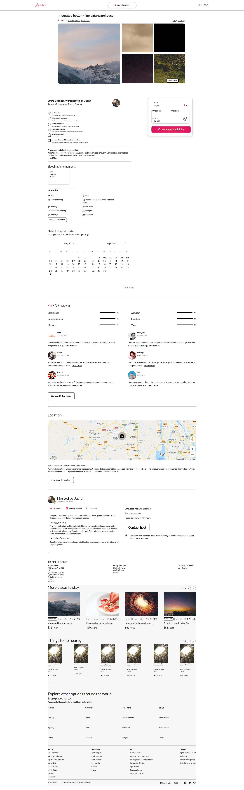
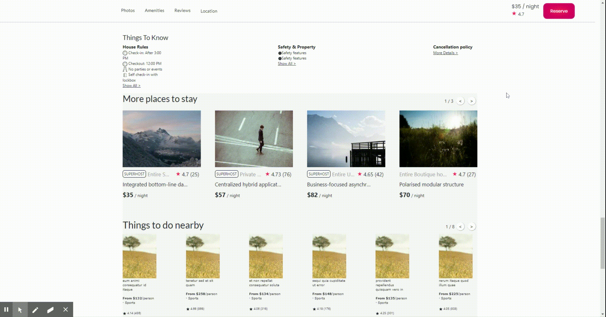

# Airbnb-Detailed Page Suggestion Service




## Related Projects

  - https://github.com/Wilberg-Airbnb/reviews
  - https://github.com/Wilberg-Airbnb/reservation
  - https://github.com/Wilberg-Airbnb/location
  - https://github.com/Wilberg-Airbnb/description
  - https://github.com/Wilberg-Airbnb/suggestion
  - https://github.com/Wilberg-Airbnb/host
  - https://github.com/Wilberg-Airbnb/photos

## Table of Contents

1. [Usage](#Usage)
1. [Requirements](#requirements)
1. [Endpoints](#Endpoints)
1. [Test](#Test)
1. [Docker](#docker)
1. [Installing Dependencies](#Installing_Dependencies)

## Usage

> run mysql -u root -p < MYSQL/schema.sql then $npm run seed to seed the data into database

>To run the app, $npm run server to start the server and $npm run react to compile the jsx files.

>To see the fully depolyed version of the website, navigate to http://3.12.169.208:1000/:listingId

- ListingId from 1-99

------

> This is the proxy of all app services rendering together
------


------

>This is the suggestion app service
------
## Requirements

An `nvmrc` file is included if using [nvm](https://github.com/creationix/nvm).

- Node 6.13.0
- Docker
- Docker
- MYSQL 8.0.20

## Endpoints
This service has one endpoint (/api/suggestions/:listingId) which gives a JSON object of array with randomly chosen listingId besides the listingId used in the query parameter. Each object in the array also holds mock data information for that respective listingId just in case the endpoints for getting the necessary data are down.

Endpoint: /api/suggestions/:listingId
```
"[{"id":20,"listingId":19,"superhost":1,"roomtype":"Entire place","numbOfBedrooms":0,"placeName":"ad","price":225.14,"pictureURL":"https://source.unsplash.com/320x240/?houses/19"},{"id":97,"listingId":96,"superhost":0,"roomtype":"shared room","numbOfBedrooms":3,"placeName":"ea","price":165.5,"pictureURL":"https://source.unsplash.com/320x240/?houses/96"},{"id":81,"listingId":80,"superhost":1,"roomtype":"Entire place","numbOfBedrooms":1,"placeName":"praesentium","price":40.76,"pictureURL":"https://source.unsplash.com/320x240/?houses/80"},{"id":68,"listingId":67,"superhost":1,"roomtype":"shared room","numbOfBedrooms":0,"placeName":"dolor","price":64.77,"pictureURL":"https://source.unsplash.com/320x240/?houses/67"},{"id":23,"listingId":22,"superhost":1,"roomtype":"Entire place","numbOfBedrooms":2,"placeName":"enim","price":42.25,"pictureURL":"https://source.unsplash.com/320x240/?houses/22"},{"id":41,"listingId":40,"superhost":0,"roomtype":"shared room","numbOfBedrooms":3,"placeName":"et","price":208.68,"pictureURL":"https://source.unsplash.com/320x240/?houses/40"},{"id":9,"listingId":8,"superhost":1,"roomtype":"shared room","numbOfBedrooms":2,"placeName":"velit","price":76.52,"pictureURL":"https://source.unsplash.com/320x240/?houses/8"},{"id":30,"listingId":29,"superhost":0,"roomtype":"shared room","numbOfBedrooms":3,"placeName":"dolorem","price":194.35,"pictureURL":"https://source.unsplash.com/320x240/?houses/29"},{"id":87,"listingId":86,"superhost":1,"roomtype":"Entire place","numbOfBedrooms":0,"placeName":"non","price":210.38,"pictureURL":"https://source.unsplash.com/320x240/?houses/86"},{"id":12,"listingId":11,"superhost":1,"roomtype":"shared room","numbOfBedrooms":2,"placeName":"ipsam","price":98.5,"pictureURL":"https://source.unsplash.com/320x240/?houses/11"},{"id":7,"listingId":6,"superhost":1,"roomtype":"Entire place","numbOfBedrooms":0,"placeName":"quod","price":153.66,"pictureURL":"https://source.unsplash.com/320x240/?houses/6"},{"id":1,"listingId":0,"superhost":0,"roomtype":"shared room","numbOfBedrooms":2,"placeName":"dolores","price":95.69,"pictureURL":"https://source.unsplash.com/320x240/?houses/0"}]"
```


## Test
This service uses Jest, Enzyme and pupetteer for testing. From within the root directory run

$npm run test

## Docker
> For linux, docker-compose needs to be installed separately.

$docker-compose up --build

## Installing_Dependencies

From within the root directory:

$npm install -g webpack
$npm install
